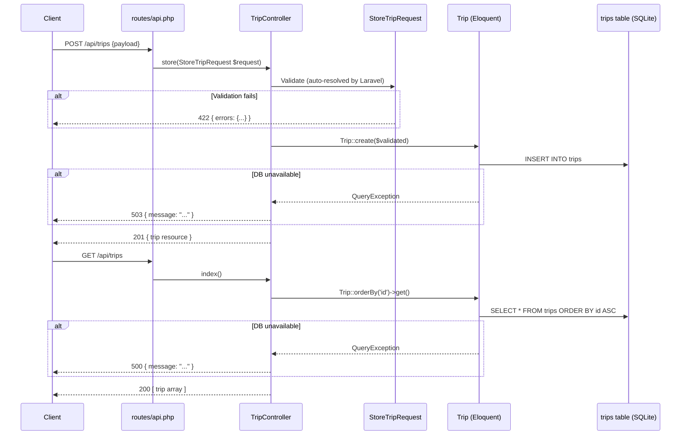

# Design Document: Trips API

## Overview

This document describes the technical design for a REST API that manages travel trips in a Laravel 13 application. The API exposes two endpoints — `POST /api/trips` to create a trip and `GET /api/trips` to list all trips — backed by a single `trips` database table. The feature adds a dedicated migration, Eloquent model, form request validator, and controller. The application uses SQLite as its database engine.

---

## Architecture

The feature follows standard Laravel MVC conventions. Incoming HTTP requests are routed through `routes/api.php` to `TripController`, which delegates validation to a `StoreTripRequest` form request and persistence to the `Trip` Eloquent model.



---

## Components and Interfaces

### routes/api.php (new file)

Laravel 13 does not bootstrap `routes/api.php` by default. The `bootstrap/app.php` must be updated to register the API route file and apply the `api` middleware group.

Defined routes:

```php
Route::get('/trips', [TripController::class, 'index']);
Route::post('/trips', [TripController::class, 'store']);
```

### TripController

**Namespace:** `App\Http\Controllers`
**File:** `app/Http/Controllers/TripController.php`

| Method | Signature | Responsibility |
|--------|-----------|----------------|
| `index` | `index(): JsonResponse` | Fetch all trips ordered by `id` ASC; return 200 JSON array |
| `store` | `store(StoreTripRequest $request): JsonResponse` | Persist validated trip; return 201 JSON object |

Error handling:
- `index`: catches `QueryException` → 500 JSON with generic message
- `store`: catches `QueryException` → 503 JSON with generic message; also catches general `\Throwable` → 500

### StoreTripRequest

**Namespace:** `App\Http\Requests`
**File:** `app/Http/Requests/StoreTripRequest.php`

Extends `Illuminate\Foundation\Http\FormRequest`. `authorize()` returns `true`.

| Field | Rules |
|-------|-------|
| `traveler_name` | `required`, `string`, `min:1`, `max:255` |
| `destination` | `required`, `string`, `min:1`, `max:255` |
| `start_date` | `required`, `date_format:Y-m-d`, `after_or_equal:today` |
| `end_date` | `required`, `date_format:Y-m-d`, `after:start_date` |
| `cost` | `required`, `numeric`, `min:0`, `max:99999.99`, `decimal:0,2` |

The 364-day maximum duration rule cannot be expressed with a built-in Laravel rule combination. It is implemented as a custom `after` validation rule closure added to the `end_date` field:

```
end_date ≤ start_date + 364 days
```

Since `end_date` must be strictly after `start_date` (at least 1 day ahead), a trip spanning start_date to start_date+364 covers exactly 364 days — the maximum allowed. A trip from Jan 1 to Jan 1 of the same year has a 0-day span (same-day), which is already rejected by `after:start_date`. The boundary case (Jan 1 to Dec 31) is 364 days and is accepted.

### Trip Model

**Namespace:** `App\Models`
**File:** `app/Models/Trip.php`

Extends `Illuminate\Database\Eloquent\Model`.

- `$fillable`: `['traveler_name', 'destination', 'start_date', 'end_date', 'cost']`
- `$casts`: `start_date` → `date:Y-m-d`, `end_date` → `date:Y-m-d`, `cost` → `decimal:2`
- No custom accessors needed; the `decimal:2` cast ensures cost serializes with exactly 2 decimal places.

### Migration

**File:** `database/migrations/{timestamp}_create_trips_table.php`

Creates the `trips` table with:

| Column | Type | Constraints |
|--------|------|-------------|
| `id` | `bigIncrements` | Primary key |
| `traveler_name` | `string(255)` | Not null |
| `destination` | `string(255)` | Not null |
| `start_date` | `date` | Not null |
| `end_date` | `date` | Not null |
| `cost` | `decimal(12, 2)` | Not null, unsigned |
| `created_at` | `timestamp` | Nullable (Laravel convention) |
| `updated_at` | `timestamp` | Nullable (Laravel convention) |

---

## Data Models

### Trip Resource (JSON representation)

```json
{
  "id": 1,
  "traveler_name": "Alice Smith",
  "destination": "Paris, France",
  "start_date": "2025-09-01",
  "end_date": "2025-09-14",
  "cost": "1250.00",
  "created_at": "2025-07-15T10:00:00.000000Z",
  "updated_at": "2025-07-15T10:00:00.000000Z"
}
```

Key formatting notes:
- `start_date` and `end_date` are serialized as `YYYY-MM-DD` strings (ISO 8601 date).
- `cost` is serialized as a string with exactly 2 decimal places (Laravel `decimal:2` cast behaviour).
- Timestamps are ISO 8601 UTC.

### Validation Error Response (JSON representation)

```json
{
  "message": "The given data was invalid.",
  "errors": {
    "start_date": ["The start date field must be a date after or equal to today."],
    "cost": ["The cost field must be at least 0."]
  }
}
```

Laravel's default 422 response shape from `FormRequest` produces this structure automatically.

---

## Correctness Properties

*A property is a characteristic or behavior that should hold true across all valid executions of a system — essentially, a formal statement about what the system should do. Properties serve as the bridge between human-readable specifications and machine-verifiable correctness guarantees.*

### Property 1: Trip creation round-trip

*For any* valid trip payload (arbitrary traveler name, destination, future start date, end date strictly after start date and within 364 days, non-negative cost ≤ 99999.99), posting it to `POST /api/trips` should return HTTP 201 and the response body should contain all submitted field values unchanged, plus an auto-generated `id`, `created_at`, and `updated_at`.

**Validates: Requirements 1.1, 1.8, 3.2, 4.2**

---

### Property 2: Missing required fields always produce 422 with field errors

*For any* non-empty subset of the five required fields (`traveler_name`, `destination`, `start_date`, `end_date`, `cost`) that are omitted from a POST request, the API should return HTTP 422 with an `errors` object that contains exactly the missing field names as keys.

**Validates: Requirements 1.2, 1.3, 3.4**

---

### Property 3: Past start dates are always rejected

*For any* date strictly before today's calendar date supplied as `start_date`, the API should return HTTP 422 with a validation error on the `start_date` field, regardless of the other field values.

**Validates: Requirements 1.4**

---

### Property 4: End date not after start date is always rejected

*For any* pair of dates where `end_date` is less than or equal to `start_date`, the API should return HTTP 422 with a validation error on the `end_date` field.

**Validates: Requirements 1.5**

---

### Property 5: Trip duration exceeding 364 days is always rejected

*For any* future `start_date` and an `end_date` that is 365 or more days after `start_date`, the API should return HTTP 422 with a validation error on the `end_date` field.

**Validates: Requirements 1.6**

---

### Property 6: Negative cost is always rejected

*For any* negative numeric value supplied as `cost`, the API should return HTTP 422 with a validation error on the `cost` field.

**Validates: Requirements 1.7**

---

### Property 7: List response ordering invariant

*For any* set of N ≥ 2 trips inserted in any arbitrary order, a `GET /api/trips` request should return a JSON array whose `id` values are strictly ascending.

**Validates: Requirements 2.1**

---

### Property 8: List response shape and field completeness

*For any* trip that has been created, every item in the `GET /api/trips` response array should contain exactly the fields `id`, `traveler_name`, `destination`, `start_date`, `end_date`, `cost`, `created_at`, and `updated_at`, with `start_date` and `end_date` formatted as `YYYY-MM-DD` and `cost` formatted as a decimal string with exactly 2 decimal places.

**Validates: Requirements 2.3, 3.3**

---

### Property 9: All created trips appear in list response

*For any* N ≥ 1 valid trips created sequentially via `POST /api/trips`, a subsequent `GET /api/trips` request should return an array of length N containing all the created trips (matched by `id`).

**Validates: Requirements 2.1, 4.4**

---

## Error Handling

| Scenario | HTTP Status | Response Body |
|----------|-------------|---------------|
| Validation failure (missing/invalid fields) | 422 | `{ "message": "...", "errors": { "<field>": ["..."] } }` |
| POST — DB unavailable (QueryException) | 503 | `{ "message": "The trip could not be saved. Please try again later." }` |
| POST — unexpected error | 500 | `{ "message": "An unexpected error occurred." }` |
| GET — DB unavailable (QueryException) | 500 | `{ "message": "Unable to retrieve trips. Please try again later." }` |
| Resource not found (future individual GET) | 404 | `{ "message": "Trip not found." }` |

All error responses carry `Content-Type: application/json`.

**Strategy in `TripController`:**

```php
// store()
try {
    $trip = Trip::create($request->validated());
    return response()->json($trip, 201);
} catch (QueryException $e) {
    Log::error('Trip creation failed: ' . $e->getMessage());
    return response()->json(['message' => 'The trip could not be saved. Please try again later.'], 503);
} catch (\Throwable $e) {
    Log::error('Unexpected error during trip creation: ' . $e->getMessage());
    return response()->json(['message' => 'An unexpected error occurred.'], 500);
}

// index()
try {
    $trips = Trip::orderBy('id')->get();
    return response()->json($trips, 200);
} catch (QueryException $e) {
    Log::error('Trip listing failed: ' . $e->getMessage());
    return response()->json(['message' => 'Unable to retrieve trips. Please try again later.'], 500);
}
```

No database internals (table names, column names, SQL) are exposed in error responses.

---

## Testing Strategy

This feature uses a dual testing approach: **example-based tests** for specific scenarios and **property-based tests** for universal invariants.

### Property-Based Testing

PHPUnit does not include a property-based testing library by default. This design uses **[giorgiosironi/eris](https://github.com/giorgiosironi/eris)**, a PHP property-based testing library that integrates with PHPUnit. Eris provides generators for strings, integers, dates, and composite values, and runs each property a minimum of **100 iterations**.

Each property test references its design property using a `@group` annotation:
```
@group Feature:trips-api, Property N: <property_text>
```

**Property tests** (`tests/Feature/TripPropertyTest.php`):
- Property 1 — Trip creation round-trip (Eris generators for valid field combinations)
- Property 2 — Missing required fields always produce 422 (Eris subset generator over required field names)
- Property 3 — Past start dates are always rejected (Eris date generator for dates before today)
- Property 4 — End date not after start date is always rejected (Eris date pair generator where end ≤ start)
- Property 5 — Duration > 364 days is always rejected (Eris future date generator + offset ≥ 365)
- Property 6 — Negative cost is always rejected (Eris negative float generator)
- Property 7 — List ordering invariant (Eris list generator, N ≥ 2 trips, shuffle order)
- Property 8 — List response field completeness (Eris valid trip generator)
- Property 9 — All created trips appear in list (Eris list generator N 1..20)

**Example-based / integration tests** (`tests/Feature/TripTest.php`):
- 2.2: Empty table returns `[]` on list with 200
- 3.1: Both endpoints return `Content-Type: application/json`
- 3.5: 404 response shape (future individual GET endpoint, verifying contract exists)
- 1.9 / 4.3: DB unavailable simulation — mock `Trip::create` to throw `QueryException` → assert 503
- 2.4: DB unavailable on list — mock `Trip::orderBy` → assert 500
- 4.1 (smoke): Migration creates correct columns (using `Schema::hasColumn`)

**Test database:** Tests use Laravel's `RefreshDatabase` trait with the SQLite in-memory driver (configured via `phpunit.xml` environment variables `DB_CONNECTION=sqlite` `DB_DATABASE=:memory:`).

### Test File Structure

```
tests/
  Feature/
    TripTest.php           # Example-based + integration tests
    TripPropertyTest.php   # Property-based tests (giorgiosironi/eris)
  Unit/
    (no unit tests required — all logic lives in form request and controller)
```
